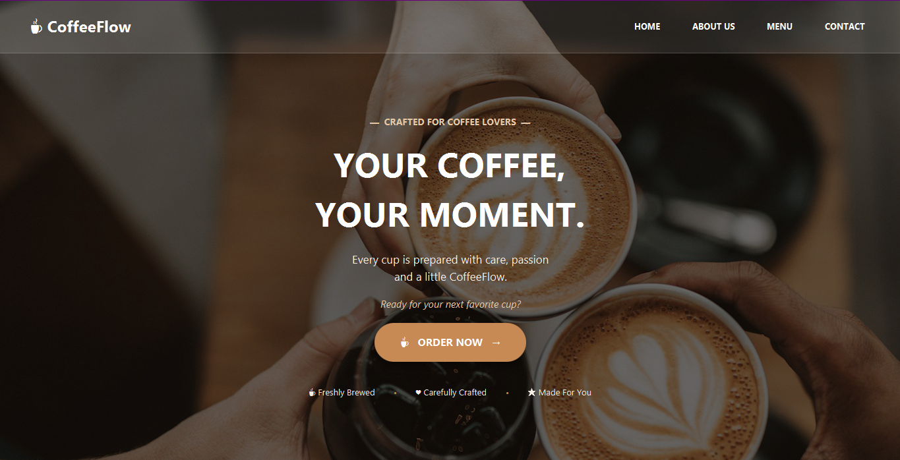
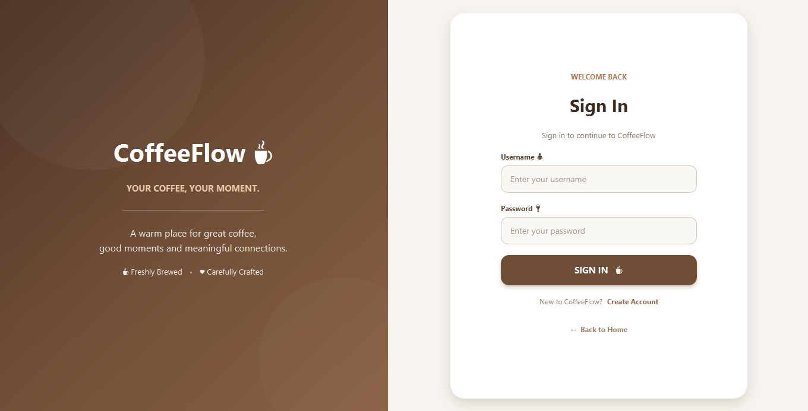
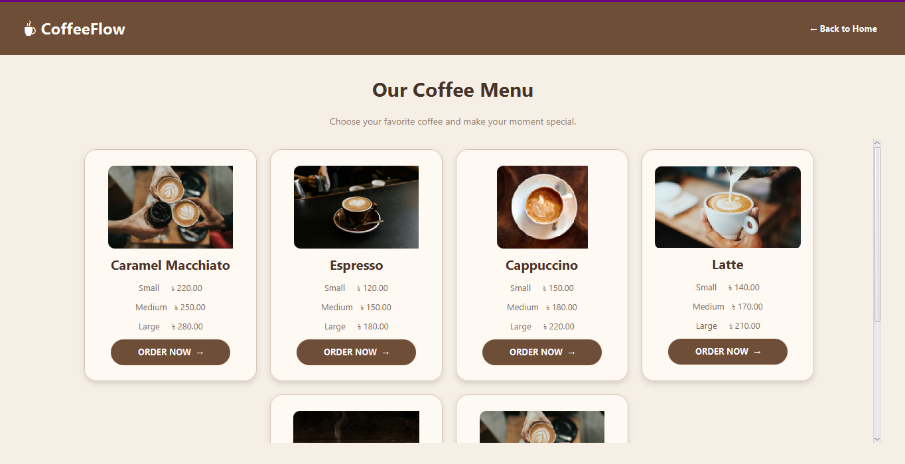
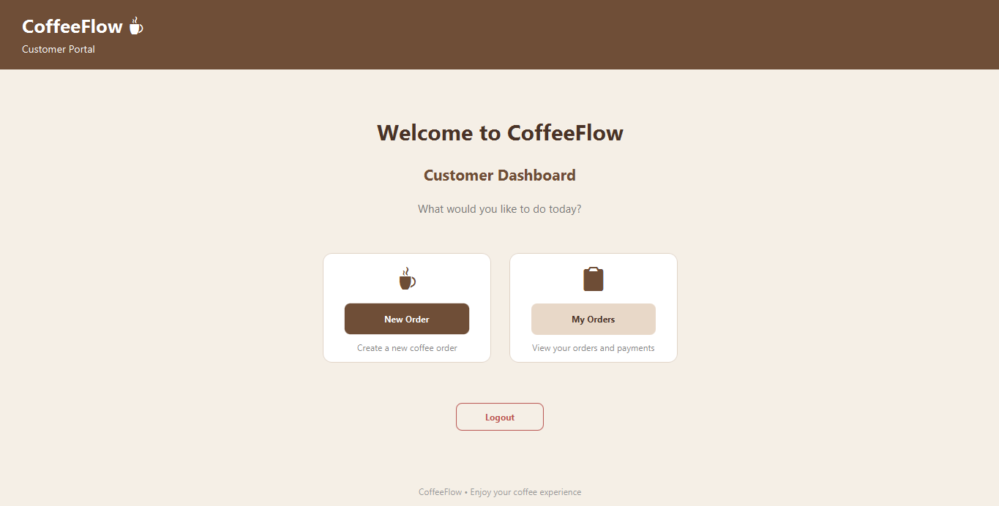
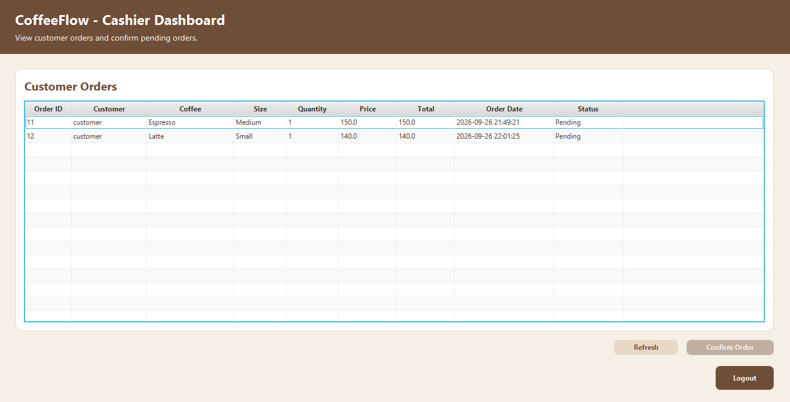
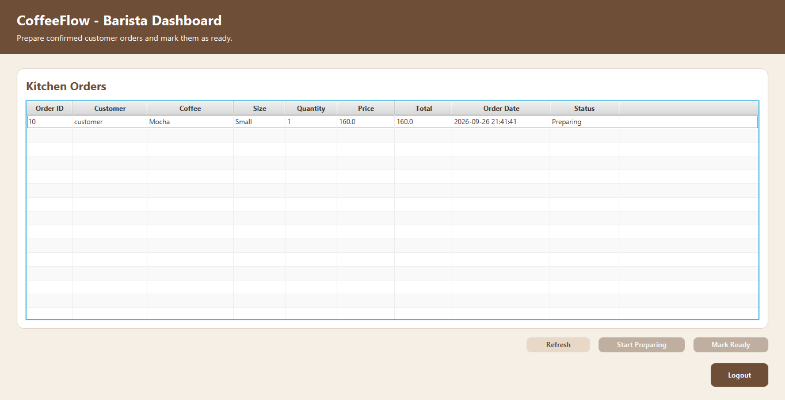

# ☕ CoffeeFlow

**CoffeeFlow** is a JavaFX-based Coffee Shop Management System developed using Java, JavaFX, SQLite, Maven, and Gson. The system provides separate functionalities for Admin, Cashier, Barista, and Customer users.

## 📌 Features

* Role-based login and authentication
* Customer registration
* Coffee menu management
* Add, edit, delete, search, and view coffee items
* Customer ordering and cart management
* Billing and payment management
* Cashier order confirmation
* Barista order preparation and status management
* Customer order history
* Pending order cancellation
* Dashboard with order and sales summary
* SQLite database integration
* HTTP request and JSON data parsing
* Multithreading and Thread Pool implementation
* Responsive JavaFX user interfaces

## 👥 User Roles

| Role         | Main Responsibilities                                    |
| ------------ | -------------------------------------------------------- |
| **Admin**    | Manage coffee menu and view dashboard summary            |
| **Cashier**  | Confirm pending customer orders                          |
| **Barista**  | Prepare orders and mark them as ready                    |
| **Customer** | Browse menu, place orders, make payments and view orders |

## 🛠️ Technologies Used

* **Java**
* **JavaFX & FXML**
* **Scene Builder**
* **SQLite**
* **JDBC**
* **Maven**
* **Jackson**
* **Git & GitHub**

## 🧩 Key Concepts

### Object-Oriented Programming

The project uses classes, objects, encapsulation, and interfaces. A `DAO` interface defines database operation methods, which are implemented by `CoffeeDAO`.

### JavaFX & Responsive UI

The application uses JavaFX layouts and controls such as:

* BorderPane
* AnchorPane
* VBox
* HBox
* GridPane
* StackPane
* TableView
* TextField
* PasswordField
* ComboBox

Responsive layouts use anchor constraints and JavaFX layout properties to adapt to different window sizes.

### 🔄 CRUD Operations

Coffee menu management supports complete CRUD operations:

**Create → Read → Update → Delete**

### 🧵 Multithreading

JavaFX `Task` and background threads are used for database loading, login, billing, and order-related operations.

A fixed Thread Pool is also implemented using `Executors.newFixedThreadPool()`.

### 🗄️ Database

The project uses **SQLite** with JDBC.

Main database entities include:

* Users
* Coffee
* Bills
* Orders

### 🌐 HTTP & JSON

The project fetches JSON data from an internet URL through an HTTP request and uses the **Gson library** to parse the JSON data into Java objects.

Internet URL
     ↓
 HTTP Request
     ↓
JSON Response
     ↓
Jackson ObjectMapper
     ↓
 Java Object

## 📂 Project Structure

CoffeeFlow
├── src
├── screenshots
├── coffeeflow.db
├── pom.xml
└── README.md

## 📸 Screenshots

### 🏠 Home Page

### 🔐 Login Page

### 👨‍💼 Admin Dashboard

### ☕ Coffee Menu

### 👤 Customer Dashboard

### 💰 Cashier Dashboard

### 👨‍🍳 Barista Dashboard

## ▶️ How to Run

1. Clone the repository.
2. Open the project in IntelliJ IDEA.
3. Configure a compatible JDK.
4. Allow Maven to download the required dependencies.
5. Run the Main class.

## 👩‍💻 Project Information

**Project:** CoffeeFlow
**Type:** Coffee Shop Management System
**Language:** Java
**GUI:** JavaFX
**Database:** SQLite
**Build Tool:** Maven
